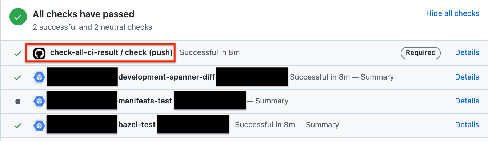

# Check All CI Completion (GitHub Actions)

[英語(Eng)](./README.md) | [日本語(JP)](./README_jp.md)

This repository publishes **GitHub Actions that make it easier to use Auto Merge when using multiple CIs**.

## Concept

If you have multiple CIs in a pull request, each working only under certain conditions, you cannot use GitHub Auto-Merge to force a specific CI to succeed.

For example, in the following figure, the Bazel and Spanner jobs are running and the Kubernetes Manifest job is not. 


In this case, no matter which job is required to complete, Auto-Merge cannot be used depending on the content of the update.


Check All CI Completion checks if all launched CIs are successful or not. This makes it easier to use GitHub Auto-merge by **forcing the Check All CI Completion job to succeed**.



## Usage

```yaml
- uses: lirlia/check-all-ci-completion-action@v1.0.0
  with:
    # Default: 1800 seconds
    # How long maintains this CI (This job waits for another jobs completion)
    job-idle-seconds: '1800'
    # Default: 300 seconds
    # Sleep seconds between check another jobs status
    sleep-seconds: '300'
```

### Full yaml (for main branch)

```yaml
name: check-all-ci-result
on:
  push:
    branches:
      - '**'        # matches every branch
      - '!main'     # excludes main
jobs:
  check-another-ci:
    name: check
    runs-on: ubuntu-20.04
    steps:
      - uses: lirlia/check-all-ci-completion-action@v1.0.0
```

### GitHub Setting

- [Setting] → [Branches] → [Branch protection rule] → [Edit] 
- enable "Require status checks to pass before merging"
- enable "Require branches to be up to date before merging"
- set "check" in "Status checks that are required."

## :warning:Caution:warning:

This job will be charged for GitHub Actions because it will continue to wait while waiting for other jobs to complete. Therefore, depending on your use case, you may be charged an unexpected amount.

## License

[License](./LICENSE)
