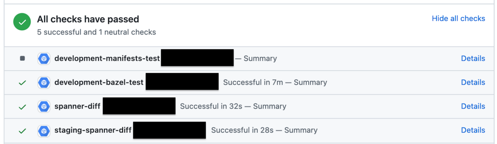

# Check All CI Completion (GitHub Actions)

[英語(Eng)](./README.md) | [日本語(JP)](./README_jp.md)

このリポジトリは、**複数 CI を利用時に Auto Merge を使いやすくするためのGitHub Actions** を公開します。

## コンセプト

複数の CI が Pull Request に存在しそれぞれが特定の条件でのみ動く場合、特定の CI の成功を強制して実行する GitHub Auto-Merge は使用できません。

例えば以下の図では、Bazel、Spanner のジョブが実行され Kubernetes Manifest のジョブは実行されていません。



このとき、どのジョブの完了を必須にしても、更新内容によっては Auto-Merge が使えません。

Check All CI Completion では、すべての起動した CI が成功しているかどうかをチェックします。そのため **Check All CI Completion ジョブが成功することを強制する** ことで GitHub Auto-merge を利用しやすくします。

## 使い方

```yaml
- uses: lirlia/check-all-ci-completion-action@v1.0.0
  with:
    # Default: 1800 seconds
    # このジョブを維持する秒数(このジョブは他のジョブの終了を待機します)
    job-idle-seconds: '1800'
    # Default: 300 seconds
    # 他のジョブの状態をチェックするまでの待機秒数
    sleep-seconds: '300'
```

### full yaml (for main branch)

```yaml
name: check-all-ci-result
on:
  push:
    branches:
      - '**'        # すべてのブランチにマッチする
      - '!main'     # main ブランチは除く
jobs:
  check-another-ci:
    name: check
    runs-on: ubuntu-20.04
    steps:
      - uses: lirlia/check-all-ci-completion-action@v1.0.0
```

### GitHub 設定

- [Setting] → [Branches] → [Branch protection rule] → [Edit] 
- "Require status checks to pass before merging" の有効化
- "Require branches to be up to date before merging" の有効化
- "Status checks that are required." の設定

## :warning:注意:warning:

このジョブは他のジョブの完了を待っている間も GitHub Actions の課金対象となるため、ユースケースによっては予期しない額の課金が発生する可能性があります。

## License

[License](./LICENSE)
